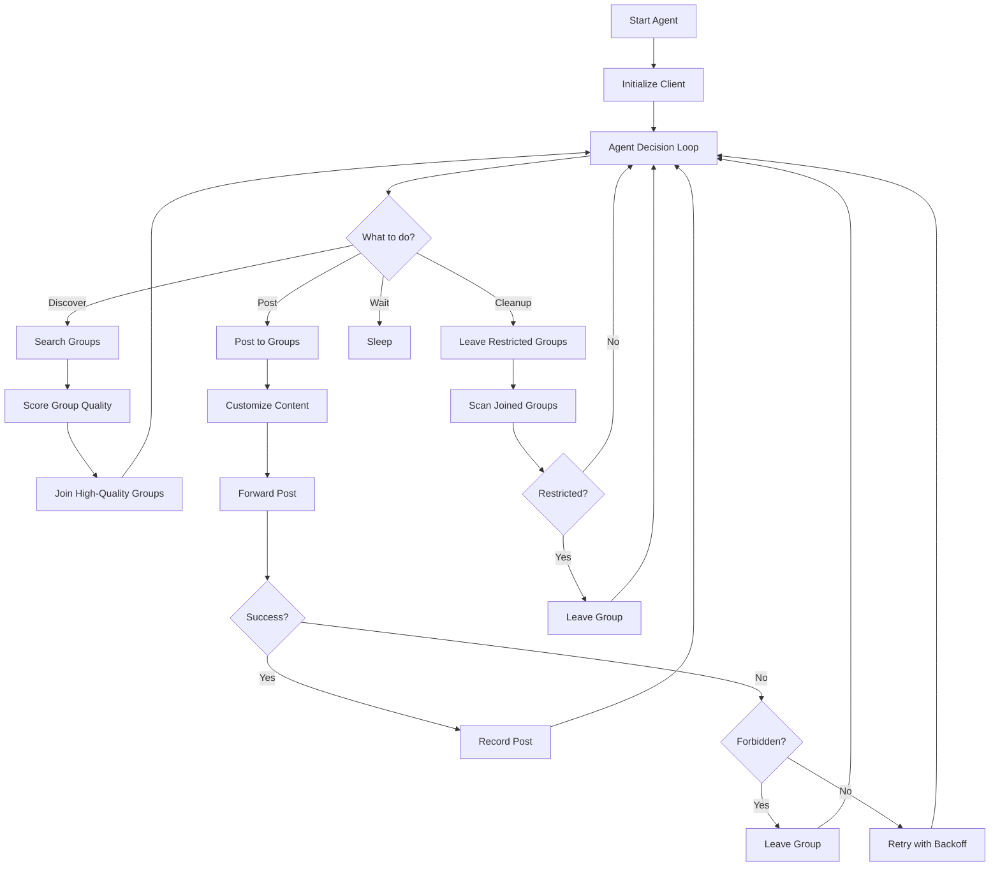

# Advanced Telegram Post Agent - Architecture

## Overview
Pure posting-focused agent that finds high-quality groups and posts content intelligently.

## System Architecture



## Core Components

### 1. SmartGroupFinder
- Searches groups using multiple keywords
- Scores groups based on:
  - Member count (sweet spot: 500-50k)
  - Activity level (online members ratio)
  - Relevance to niche
  - Open posting permissions
  - Not already posted to

### 2. ContentCustomizer
- Adapts message for each group
- Adds group-specific context
- Handles different content types (text, media, polls)

### 3. PostingEngine
- Smart retry with exponential backoff
- Duplicate prevention
- Batch posting with delays
- Auto-leave on restriction

### 4. QualityTracker
- Tracks group performance
- Blacklists underperforming groups
- Maintains group quality database

## Tools (New Agent)
```javascript
[
  { name: "searchGroups", description: "Find new groups by keywords" },
  { name: "joinGroup", description: "Join a promising group" },
  { name: "postToGroups", description: "Post latest content to joined groups" },
  { name: "cleanupGroups", description: "Leave restricted/inactive groups" },
  { name: "wait", description: "Wait for cooldown" },
  { name: "finishTask", description: "Complete daily work" }
]
```

## State Tracking
```javascript
{
  currentAccount: "session",
  joinedGroups: [],
  postedToday: 0,
  postLimit: 50,
  lastPostTimestamp: null,
  qualityGroups: [],
  restrictedGroups: [],
  floodWaitSeconds: 0
}
```

## Advanced Features

### 1. Group Quality Scoring
- LLM scores groups 1-10 based on:
  - Relevance to niche
  - Active member ratio
  - Posting history success rate

### 2. Smart Retry Logic
- Exponential backoff: 5s, 10s, 20s, 40s...
- Max 3 retries per group
- Auto-blacklist after repeated failures

### 3. Content Adaptation
- Detects group language
- Customizes message per group type
- Adds relevant hashtags

### 4. Anti-Detection
- Random delays between posts (15-60s)
- Account rotation on flood wait
- Human-like action patterns
