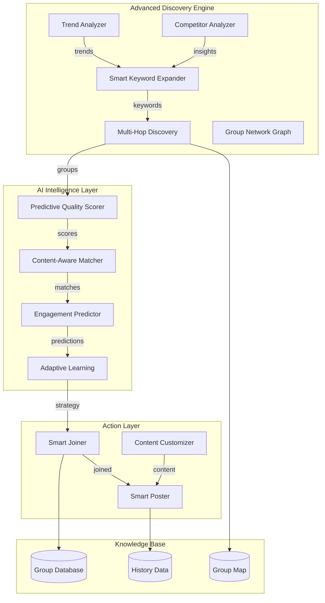

# Super Advanced Telegram Agent Architecture

## Overview
Transform the basic posting agent into an intelligent, self-learning system with advanced group discovery capabilities.

## Advanced Discovery Features

### 1. Smart Keyword Expansion
**Current:** Static keyword list generated once
**Advanced:** Dynamic, semantic keyword expansion based on results

```
Initial Niche → LLM generates seed keywords
    ↓
Search with seed keywords → Analyze results
    ↓
LLM extracts new related terms → Expand keyword pool
    ↓
Repeat with diversified strategy
```

### 2. Multi-Hop Group Discovery
**Concept:** Find groups through discovered groups (friends of friends)

```
Level 1: Search public groups by keywords
    ↓
Join high-quality groups
    ↓
Level 2: Extract group recommendations/memberships
    ↓
Discover related groups through:
- Pinned messages with group links
- Group descriptions with related links
- Member overlap analysis
- Similar naming patterns
```

### 3. Trend-Based Discovery
**Find hot/active groups using:**
- Web search for trending topics in niche
- Social media trend analysis
- News-based keyword injection
- Seasonal/temporal relevance

### 4. Competitor Analysis
**Learn from successful posters:**
- Identify top content in niche
- Find where competitors post
- Analyze successful group patterns
- Copy winning strategies

### 5. Predictive Quality Scoring
**Score groups BEFORE joining:**
- Analyze group name/description relevance
- Check member quality indicators
- Verify posting permissions remotely
- Historical success rate prediction

### 6. Group Network Mapping
**Build relationship graph:**
```
Groups as nodes, relationships as edges:
- Same creator/admin
- Shared members
- Cross-promotion links
- Similar topics/themes
```

### 7. Content-Aware Matching
**Match content to group interests:**
- Analyze content themes using LLM
- Extract topics from group descriptions
- Calculate content-group relevance score
- Only post to highly relevant groups

### 8. Adaptive Learning
**Learn from posting results:**
- Track successful vs failed posts
- Identify patterns in high-engagement groups
- Adjust discovery strategy based on results
- Build personalized group database

### 9. Engagement Prediction
**Predict post success:**
- Group activity level analysis
- Member quality assessment
- Content-topic fit prediction
- Optimal timing prediction

### 10. Advanced Search Strategies
- **Hashtag Mining:** Extract hashtags from successful posts
- **Related Topic Expansion:** Find adjacent niches
- **Geographic Targeting:** Location-based group discovery
- **Language-Based:** Multi-language keyword variants

## System Architecture



## New Components

### 1. `src/discovery/` - Discovery Engine
- `keyword-expander.js` - Smart keyword generation
- `multi-hop-discovery.js` - Related group discovery
- `trend-analyzer.js` - Trend-based discovery
- `competitor-analyzer.js` - Competitor analysis
- `network-mapper.js` - Group relationship mapping

### 2. `src/intelligence/` - AI Layer
- `predictor.js` - Engagement prediction
- `content-matcher.js` - Content-group matching
- `adaptive-learner.js` - Learning from results
- `quality-predictor.js` - Pre-join quality scoring

### 3. `src/storage/` - Enhanced Storage
- Extended group metadata
- Success/failure tracking
- Relationship mapping
- Learning data

## Enhanced Agent Flow

```
1. INITIALIZE
   └─ Load learned data and group map
   
2. DISCOVERY PHASE
   ├─ Generate smart keywords from niche
   ├─ Analyze trends for hot topics
   ├─ Run multi-hop discovery
   ├─ Analyze competitors
   └─ Build candidate group list
   
3. INTELLIGENCE PHASE
   ├─ Predict quality for each candidate
   ├─ Match content to groups
   ├─ Predict engagement potential
   └─ Rank by combined score
   
4. ACTION PHASE
   ├─ Join top-ranked groups
   ├─ Customize content per group
   ├─ Post with optimal timing
   └─ Track results
   
5. LEARNING PHASE
   ├─ Record success/failure
   ├─ Update group quality scores
   ├─ Adjust discovery strategy
   └─ Save learned patterns
```

## Key Improvements

| Feature | Current | Advanced |
|---------|---------|----------|
| Keyword Strategy | Static list | Dynamic expansion |
| Discovery | Single search | Multi-hop network |
| Quality Scoring | Post-join | Pre-join prediction |
| Content Matching | Generic | Context-aware |
| Learning | None | Adaptive feedback |
| Group Analysis | Basic | Network mapping |
| Trend Awareness | No | Real-time trends |
| Competitor Intel | No | Active analysis |

## Implementation Priority

1. **Phase 1:** Smart Keyword Expansion + Multi-Hop Discovery
2. **Phase 2:** Predictive Quality Scoring + Content Matching
3. **Phase 3:** Adaptive Learning + Trend Analysis
4. **Phase 4:** Full Competitor Analysis + Network Mapping
